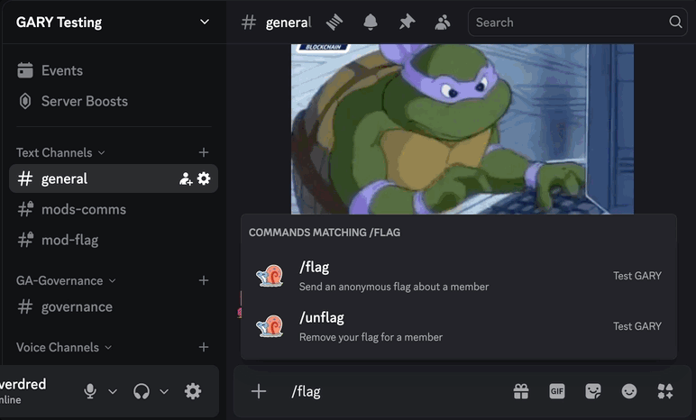
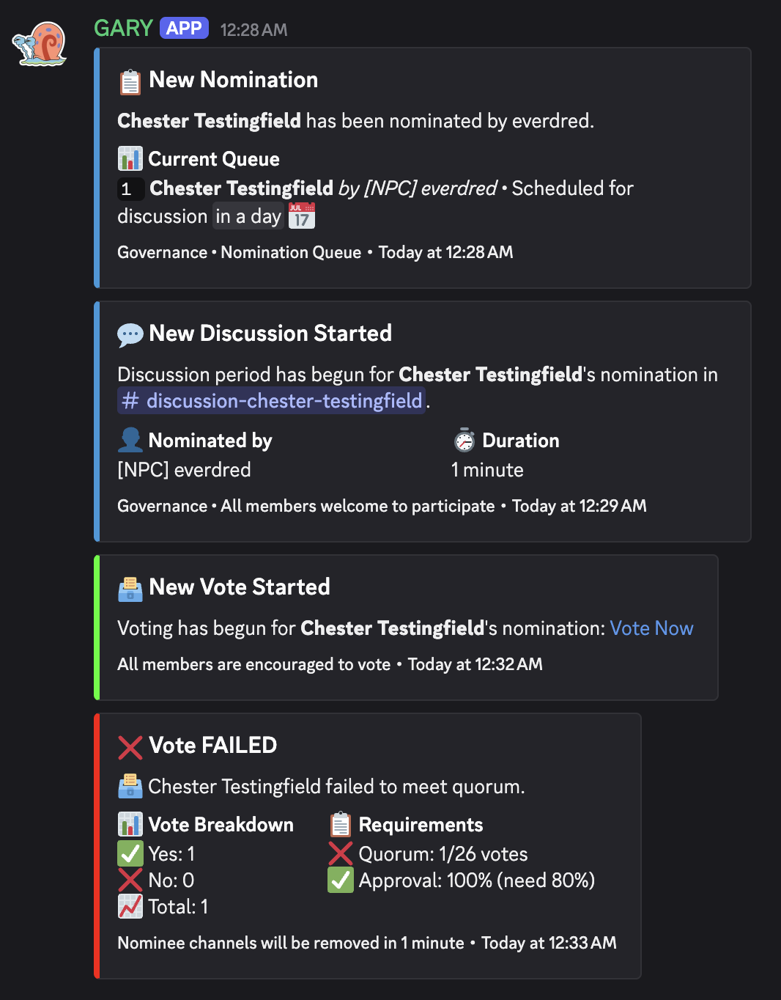

# GARY

## User Commands

### Flag

- `/flag target:<@user> message:<text>` - Flag a user anonymously to moderators

  - Sends anonymous notification to mod channel
  - Tracks toward 40% kick quorum
  - Flags do not expire
  - Prevents duplicate flags from-to the same user

- `/unflag target:<@user>` - Remove your flag for a user
  - Shows full original message in notification
  - Notifies moderators of the unflag action

Demo:

### Nomination

- `/nominate add name:<text>` - Nominate someone for membership

  - Starts the nomination process
  - Queues nominee if another is in progress
  - Automatically schedules discussion/vote periods

- `/nominate list` - List all current nominations and their state
  - Shows ACTIVE, DISCUSSION, VOTE, CLEANUP nominees
  - Displays scheduled times for queued nominees

Demo:

## Mod Commands

### Nomination Management

- `/mod nominate add name:<text> nominator:<@user>` - Add nomination on behalf of someone

  - Creates nomination as if the specified user nominated
  - Useful for migrating existing nominations

- `/mod nominate remove name:<text>` - Remove a nominee from the list

  - Permanently removes nominee from any state
  - Cleans up associated channels if they exist

- `/mod nominate start [name:<text>]` - Start discussion for specific nominee or next in queue

  - Forces immediate discussion start
  - Optional name parameter to skip queue order
  - Creates discussion channel and announcements

- `/mod nominate discussion hours:<number>` - Set discussion duration for current nominee

  - Overrides the total discussion duration (not additive)
  - Must be positive number of hours
  - Automatically transitions to VOTE if duration already elapsed
  - Reschedules queued nominees if extending

- `/mod nominate cleanup` - Complete cleanup early and cleanup channels
  - Only works for nominees in CLEANUP state
  - Removes discussion and vote channels
  - Transitions nominee to PAST state
