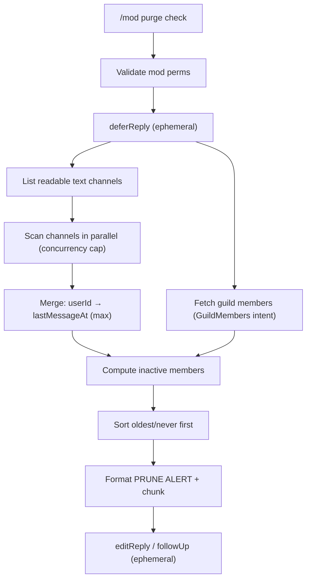

# feat: Add `/mod purge check` inactivity report

## Summary

Add a mod-only `/mod purge check` slash subcommand that reports which server members have been inactive (no messages) for at least `PRUNE_WEEKS` weeks (new env var, default 6). The command replies **ephemerally** to the calling moderator with a ranked `⚠️ PRUNE ALERT` list of member names, their last-message date, and a humanized age. Message-history scanning is parallelized across channels.

This is a **read-only report** — it does not kick, warn, or modify anyone.

---

## Problem Frame

Moderators of this ~50-member, ~20-channel invite-only community need a way to spot inactive members who may be candidates for pruning. There is currently no visibility into per-member last-activity. Doing this by hand across 20 channels is impractical.

The command answers one question: *"Who hasn't said anything anywhere in the last N weeks, and when did they last post?"*

---

## Scope Boundaries

**In scope**
- `/mod purge check` subcommand (mod-only, ephemeral response).
- `PRUNE_WEEKS` env var (default 6) controlling the inactivity threshold.
- Full message-history scan across all readable text channels, parallelized.
- Full member roster via the privileged **Server Members Intent** (so members who never posted are also detected).
- Ranked output with name, exact last-message date, and humanized age.

**Out of scope (non-goals)**
- Actually pruning/kicking/warning members. This is check-only.
- Any scheduled/automated pruning job.
- DM notifications to inactive members.

### Deferred to Follow-Up Work
- Scanning thread history (forum/threads) — this plan scans top-level text channels only.
- A `/mod purge run` companion that acts on the report.
- Caching/incremental scans if the server grows large enough that full scans get slow.

---

## Key Technical Decisions

**KTD1 — Use the privileged Server Members Intent for the roster.** Detecting inactive members (including those who never posted) requires knowing the full roster, which Discord only exposes via `guild.members.fetch()` under the privileged `GuildMembers` intent. We add `GatewayIntentBits.GuildMembers` to the client. **This has an out-of-band prerequisite:** the "Server Members Intent" toggle must be enabled in the Discord Developer Portal for the bot, on every deployment (test + prod). The user owns that portal toggle; the code change alone is insufficient. Recorded in Risks.

**KTD2 — Full-history scan, newest→oldest, tracking max timestamp per author.** For each readable text channel, page `messages.fetch({ limit: 100, before })` from newest to oldest until history is exhausted, recording each author's most-recent message timestamp (the first time we encounter them, since we page newest-first, so later/older pages can be skipped for already-seen authors). Merge per-channel maps into a global `userId → lastMessageAt` by taking the max. This yields exact last-post dates, which the requested output needs. Justified by scale: ~50 members / ~20 channels is small enough that a full scan completes well within the 15-minute deferred-interaction window.

**KTD3 — Bounded parallelism across channels.** Scan channels concurrently through a small worker pool (concurrency cap, default ~5) rather than all-at-once or serially. discord.js already queues and throttles REST calls to respect rate limits, but a cap bounds memory and avoids saturating the REST queue. This is the "optimize parallelization" requirement — the wall-clock cost is the slowest channel, not the sum of all channels.

**KTD4 — Ephemeral deferred reply.** The scan exceeds Discord's 3-second ack window, so the handler calls `deferReply({ flags: 64 })` immediately (ephemeral = silent to the channel, visible only to the caller) and `editReply`s with the report when done.

**KTD5 — Output chunking.** A 50-member report can exceed Discord's 2000-char message limit. Format the list as plain text and split into multiple `followUp({ flags: 64 })` messages when over the limit, keeping each chunk under 2000 chars.

---

## High-Level Technical Design

Inactive = member (non-bot) whose `lastMessageAt` is missing (never posted) OR older than `now - PRUNE_WEEKS`.

---

## Implementation Units

### U1. Config + intent prerequisites

**Goal:** Introduce `PRUNE_WEEKS` and enable the roster intent.

**Requirements:** KTD1, `PRUNE_WEEKS` env var.

**Dependencies:** none.

**Files:**
- `apps/bot/src/lib/configService.ts` — add `getPruneWeeks(): number` returning `parseInt(process.env.PRUNE_WEEKS || '6')`, with a guard falling back to `6` when unset/`NaN`/`<= 0`.
- `apps/bot/src/index.ts` — add `GatewayIntentBits.GuildMembers` to the client intents (line ~37-42).
- `apps/bot/src/lib/envValidator.ts` — add `PRUNE_WEEKS?: string` to `EnvConfig` (optional, NOT in `REQUIRED_ENV_VARS`); if present, validate it parses to a number in the existing numeric-validation loop.
- `apps/bot/.env.example` — document `PRUNE_WEEKS=6`.

**Approach:** Mirror the existing optional-numeric config pattern (`getKickQuorumPercent`, `getLogLevel`). `PRUNE_WEEKS` stays optional so existing deployments keep working with the default.

**Patterns to follow:** `ConfigService.getKickQuorumPercent`, existing numeric validation in `envValidator.ts`.

**Test scenarios:**
- `getPruneWeeks()` returns 6 when `PRUNE_WEEKS` unset.
- Returns parsed value when set to a valid positive integer (e.g. `4`).
- Falls back to 6 when set to non-numeric or `<= 0`.

---

### U2. Humanized "time ago" + date formatting util

**Goal:** Produce `"July 2, 2025"` and `"12 months, 2 weeks"` style strings.

**Requirements:** output format in the PRUNE ALERT example.

**Dependencies:** none.

**Files:**
- `apps/bot/src/lib/pruneFormatUtils.ts` — `formatAbsoluteDate(date)` → `"July 2, 2025"`; `formatTimeAgo(from, to)` → `"12 months, 2 weeks"` (largest two non-zero units among years/months/weeks/days).
- `apps/bot/src/tests/pruneFormatUtils.test.ts`

**Approach:** Pure functions, no Discord dependency, so they are trivially unit-testable. Compute month/week/day deltas from two `Date`s; render the two largest non-zero units, pluralizing correctly. Keep it dependency-free (no date libraries — none are in the stack).

**Patterns to follow:** `NomineeDisplayUtils.formatDuration` (pluralization style), `timeCalculation.ts` (date math without external libs).

**Test scenarios:**
- Exactly 6 weeks ago → `"1 month, 2 weeks"` (or documented equivalent) — pin the exact expected string in the test.
- ~12.5 months ago → `"12 months, 2 weeks"`.
- Under a week → `"X days"` single unit.
- `formatAbsoluteDate` renders `"July 2, 2025"` for a known date (assert in UTC to avoid TZ flakiness).
- Pluralization: `"1 week"` vs `"2 weeks"`, `"1 month"` vs `"2 months"`.

---

### U3. Member inactivity scan service (core + parallelization)

**Goal:** Scan history and compute the inactive-member list.

**Requirements:** KTD2, KTD3; core feature behavior.

**Dependencies:** U1.

**Files:**
- `apps/bot/src/lib/pruneService.ts` — `PruneService` class (constructed with `Client`, matching `VoteResultService`/`ChannelManagementService`).
- `apps/bot/src/tests/pruneService.test.ts`

**Approach:**
- `getInactiveMembers(guildId): Promise<InactiveMember[]>` where `InactiveMember = { userId, displayName, lastMessageAt: Date | null }`.
- Resolve guild; enumerate text-based channels the bot can read (reuse the permission check pattern from `voteResultService.canReadVoteChannel` — `channel.permissionsFor(me)` has `ViewChannel` + `ReadMessageHistory`). Skip unreadable channels and count them for the report footer.
- Scan channels through a concurrency-capped pool (cap from a module constant, default 5). Per channel: page `messages.fetch({ limit: 100, before })` newest→oldest until empty, recording `authorId → max(createdTimestamp)`; skip bot authors.
- Merge per-channel maps into a global `Map<userId, Date>` (max).
- `guild.members.fetch()` for the roster; for each non-bot member compute inactivity vs cutoff `now - PRUNE_WEEKS*7d`. Include members missing from the activity map (`lastMessageAt: null`).
- Sort: never-posted first, then oldest `lastMessageAt` first.

**Patterns to follow:** `VoteResultService` (class shape, `guild.members.me` / `permissionsFor`), `channelLookupService` (channel iteration), `jobScheduler` parallelization is absent — introduce a minimal internal concurrency pool helper here.

**Test scenarios:**
- Member with a recent message (< cutoff) is excluded.
- Member whose newest message across all channels is older than cutoff is included with correct `lastMessageAt`.
- Member present in roster but absent from all history → included with `lastMessageAt: null`.
- Bots excluded from both the roster output and the activity map.
- A user's last message lives in a different channel than their earlier ones → global max picks the newest across channels.
- Unreadable channel is skipped without throwing and does not abort the scan.
- Sort order: never-posted first, then oldest-first.
- Concurrency pool processes all channels (result independent of cap value).

---

### U4. `/mod purge check` command wiring + output

**Goal:** Register the subcommand, route it, format and send the report.

**Requirements:** KTD4, KTD5; full feature.

**Dependencies:** U2, U3.

**Files:**
- `apps/bot/src/commands/purge/check.ts` — `handlePurgeCheckCommand(interaction)`.
- `apps/bot/src/commands/mod.ts` — add a `purge` subcommand group with a `check` subcommand; import + route in `modHandler` (`subcommandGroup === 'purge'`).
- `apps/bot/src/tests/pruneCheck.test.ts` (formatting-focused).

**Approach:**
- Validate mod perms via `CommandUtils.validateModeratorAccess` (matches `cleanup.ts`).
- `deferReply({ flags: 64 })` immediately.
- Call `PruneService.getInactiveMembers(guildId)`.
- Empty list → edit reply with a friendly "✅ No members inactive for N+ weeks."
- Otherwise build the `⚠️ PRUNE ALERT` block: header + numbered rows `N. {name} - {formatAbsoluteDate(lastMessageAt)} ({formatTimeAgo}...)`; never-posted rows show `Never`. Chunk to stay < 2000 chars, sending the first via `editReply` and the rest via `followUp({ flags: 64 })`.
- Wrap in try/catch → `CommandUtils.handleCommandError`.

**Patterns to follow:** `commands/nominate/cleanup.ts` (mod validation, defer, editReply, error handling), `mod.ts` subcommand-group builder, `modHandler` switch.

**Test scenarios:**
- Formats a multi-member list matching the `⚠️ PRUNE ALERT` shape (name, date, humanized age), numbered.
- Never-posted member renders as `Never` in the age column.
- Empty list renders the "no inactive members" message.
- A list large enough to exceed 2000 chars splits into multiple chunks, each under the limit.
- Non-moderator caller is rejected before any scan (mock `validateModeratorAccess` → invalid; assert `PruneService` not called).

---

### U5. Documentation

**Goal:** Document the command and env var.

**Requirements:** discoverability.

**Dependencies:** U1–U4.

**Files:**
- `COMMANDS.md` — add `/mod purge check` under Mod Commands, noting the ephemeral output and `PRUNE_WEEKS`.
- `apps/bot/README.md` — note the new `PRUNE_WEEKS` var and the required Server Members Intent portal toggle, if env/intents are documented there.

**Test expectation:** none — documentation only.

---

## Risks & Dependencies

- **Privileged intent portal toggle (external prerequisite).** `GatewayIntentBits.GuildMembers` in code will cause the bot to fail login with a disallowed-intents error unless "Server Members Intent" is enabled in the Discord Developer Portal for the bot. This must be toggled for both the staging and production bot applications. *Mitigation:* call this out in the PR description and README; the user drives the portal change. Verify on staging first.
- **Rate limits on large/old servers.** Full-history scans are O(total messages). Fine at ~50 members / ~20 channels, but could get slow if the server grows. *Mitigation:* concurrency cap + deferred interaction (15-min window); bounded-scan fallback noted in Deferred follow-up.
- **Threads not scanned.** Activity that only happens in threads/forum posts won't count, so a thread-only-active member could be falsely flagged. *Mitigation:* documented non-goal; revisit if it matters in practice.
- **Members who left.** Ex-members appear in history but not the roster, so they're correctly not flagged (we iterate the roster, not history authors).

---

## System-Wide Impact

- Adds one privileged intent to the client — increases the gateway payload (member data) but negligible at this scale.
- No database schema changes. No changes to the nomination/voting pipeline.
- New command surface only; existing commands unaffected. Global command registration means the new subcommand takes up to ~1h to appear (existing behavior).

---

## Verification

- `npm run build`, `npm run lint`, and `bun test` all pass.
- On staging (with the portal intent enabled): `/mod purge check` returns an ephemeral `⚠️ PRUNE ALERT` list; a known-recently-active member is absent; a known-dormant member appears with a plausible last-post date; setting `PRUNE_WEEKS=1` widens/narrows the list as expected.
